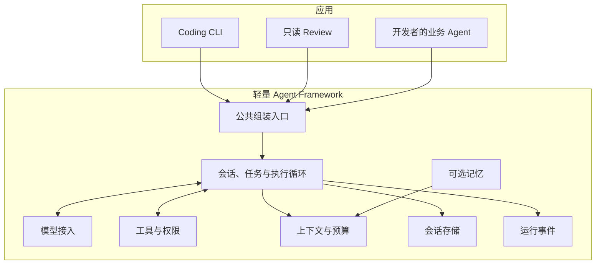

# 产品总览：AutoCoding Machine

[返回首页](../README.md) · [当前架构](architecture.md) · [组合示例](harness-cookbook.md) · [执行路线](plans/README.md)

## 产品定位

AutoCoding Machine 是轻量、模块化、可组合的 Python Agent Framework。

开发者提供模型、工具和业务规则，框架处理执行循环、会话、上下文、权限与运行事件。开发者可以用它构建自己的 Agent，并保留对提示词、数据、工具和交互方式的控制。

Coding CLI 是本框架的实际应用，承担两件事情：为终端使用者提供完整的编码助手，同时持续验证框架能否支持一个真实应用。CLI 的界面演进与框架的公共接口演进分别管理。

## 用户与价值

| 用户 | 希望完成的事情 | 产品提供的价值 |
| --- | --- | --- |
| 应用开发者 | 把自己的模型和业务工具组合成 Agent | 复用执行循环、权限、会话与事件，专注业务能力 |
| 能力提供者 | 接入模型、工具、记忆或存储实现 | 通过明确的小接口连接已有运行机制 |
| CLI 使用者 | 读取项目、修改代码、审查问题并控制操作 | 可观察过程、批准权限、取消任务和恢复会话 |

衡量产品的关键问题：一个新开发者能否根据文档，在自己的项目中安装本包、组合能力、完成任务，并理解失败和权限边界？

## 最终形态

最终产品由可独立使用的框架核心、按需选择的能力和基于框架构建的应用组成。

图中按产品职责分组，代码目录以[架构说明](architecture.md)为准。

最终使用体验应当具备以下特点：

- **入口简单**：常用任务通过少量公共接口完成，默认设置可直接使用。
- **模块可替换**：开发者可以选择模型、自定义工具、会话存储、记忆和观察回调。
- **核心轻量**：核心安装只包含运行必需的依赖；终端界面和外部服务按需安装。
- **操作可控**：权限决定、取消、资源预算和失败行为明确，关键状态可观察。
- **应用独立**：CLI 管理终端体验，业务应用管理自己的交互和业务流程。

其中“核心安装与 CLI 可选依赖分开”属于目标形态；当前依赖仍在同一安装组，尚未发布到 PyPI。

## 自由组合意味着什么

开发者可以选择现有模块，也可以按契约接入自己的实现。组合空间随业务能力增加而扩展。

| 组合 | 模型与工具 | 交互方式 | 当前状态 |
| --- | --- | --- | --- |
| 编码助手 | 模型 + 文件与命令工具 + Coding 权限规则 | Textual CLI | 已实现；Textual 迁移仍为工作区改动 |
| 项目审查助手 | 模型 + 只读工具 + Review 提示词 | 无界面程序或 CLI | 已验证独立调用 |
| 订单回复助手 | 模型 + 订单查询与草稿工具 + 业务提示词 | Python 调用方显式处理权限 | 已有本地组合示例 |
| 企业知识助手 | 模型 + 企业检索工具 + 明确的数据作用域 | 开发者选择自己的界面 | 组合方向，尚未完成实际应用验证 |

Profile 是组合配方，Adapter 连接具体实现，工具实现业务动作。开发者通过 Python 显式注册自定义能力；YAML 选择已有能力。

“无限组合可能”表达开放的产品方向。每个组合仍需满足接口契约、权限、数据作用域和资源预算，具体应用需要验证。

## 能力地图与当前进度

| 能力 | 当前可以使用的部分 | 仍需明确的边界 |
| --- | --- | --- |
| 公共入口 | `open_harness_session` 与根包导出 | 版本兼容规则和稳定发布流程 |
| 模型 | 注入模型调用函数；现有 ModelAdapter | 不承诺所有供应商协议都能直接兼容 |
| 工具 | 显式注册自定义工具，复用执行与权限机制 | 动态插件安装尚未实现 |
| 会话与任务 | AgentSession、AgentRun、默认 JSONL、暂停恢复与取消 | 取消为协作式，已发生的副作用保留 |
| 上下文 | 历史选择、预算、压缩及临时请求视图 | 长任务规划与专项优化仍待需求驱动 |
| 权限与限制 | 自动放行、请求批准、拒绝、工作区与轮数限制 | 工作区限制不提供操作系统级隔离 |
| 记忆 | 内置记忆、MemoryProvider、显式 MemoryWriter、Tencent Adapter | 腾讯云部署未验证；外部写回默认关闭 |
| 事件 | 同步脱敏观察回调与明确权限交接 | 异步公共接口和 SSE 传输尚未实现 |
| 修改完成验证 | Coding 专属实验功能，可显式开启 | 默认关闭；不保证全部需求或测试覆盖完整 |
| CLI | Textual 界面、会话管理、工具详情、权限弹窗与流式展示 | 已在 `dev` 实现并推送，尚未合并到 `main`；实体终端交互仍待验收 |

框架已具备轻量 v0.1 的复用能力，独立安装与多个调用方式已有验证。模块组装仍包含 Coding 默认能力；核心与应用依赖的进一步分离属于后续工作。具体阶段和验收证据见[执行路线](plans/README.md)，产品总览不重复阶段历史。

## 一次任务的工作流

1. **打开会话**：调用方选择 Profile、模型、工具和可选能力，公共入口组装运行组件。
2. **接收任务**：会话保存用户输入，创建一次 AgentRun。
3. **准备上下文**：选择历史、指令和资料，检查预算；明确启用时召回外部记忆。
4. **请求模型**：模型返回回答或工具调用。
5. **处理工具**：检查权限，必要时暂停等待批准；工具检查参数与工作区边界，再返回结果。
6. **继续执行**：保存工具回执并交给模型；取消、轮数预算与 Guard 控制继续条件。
7. **交付结果**：明确启用完成验证时先检查修改证据，再返回当前状态与回答。
8. **可选写回**：成功任务按显式策略保存用户输入与最终回答。

运行事件贯穿任务过程，供界面和其他观察方使用。原始会话历史由 SessionStore 保存，界面和压缩视图按需重建；外部记忆管理跨会话可复用的信息。

已分类的失败通过 Run Result 返回；未被处理的模型或组件异常向调用方抛出。工具执行后写入失败会停止任务，避免自动重复有副作用的操作。具体约定见 [Cookbook](harness-cookbook.md#6-运行结果与事件契约)。

## 产品边界与后续判断

框架保持小的公共接口，提供可靠的运行机制。具体业务流程由调用方管理；新增扩展接口应对应真实的替换需求，并附有组合示例和契约验证。

近期产品验收围绕三个结果：

- 新开发者按文档完成独立安装和一个真实业务任务。
- CLI 能清楚展示任务状态，并正确处理批准、拒绝、取消、恢复与失败。
- 自动测试和构建持续验证公共接口及交付包。

插件安装、复杂多 Agent 编排、托管服务和插件市场保留为需求驱动的扩展方向。它们分别评估，不作为当前轻量框架交付的前置条件。

## 文档如何分工

- 本文记录产品定位、最终形态、能力地图和产品边界。
- [架构说明](architecture.md)记录当前实现、模块职责和具体限制。
- [快速入门](harness-quickstart.md)与 [Cookbook](harness-cookbook.md)说明开发者怎样使用。
- [CLI 指南](cli.md)说明终端应用怎样操作。
- [执行路线](plans/README.md)记录当前工作、阶段验收和未来方向。

改变产品目标时更新本文；实现发生变化时同步架构和能力状态；新增阶段任务放入执行路线。
